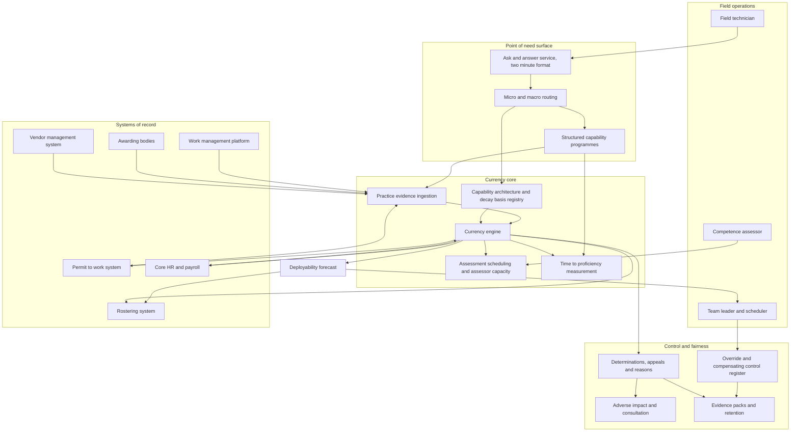

# Whetmark

**Source:** `ai-in-hr/deloitte-joshBersin_Conference-congres2017/`
**Domain:** `ai-hr`
**One-liner:** A capability-currency register for safety-critical and technical workforces that treats every recorded skill as a decaying asset with an expiry clock, proves currency from evidence of recent practice rather than a training completion, and tells operations how many genuinely deployable competent people it will have on shift tomorrow morning.
**Wedge:** Competence assurance in regulated field operations — electricity and water network operators, rail infrastructure managers, and industrial service contractors with 3,000–30,000 frontline staff — instrumented first on the statutory authorisation set (switching, isolation, high-voltage access, confined space, working at height) plus the thirty technical competencies that gate revenue work.
**Positioning:** Competence assurance, re-based on decay. Learning platforms and talent suites record acquisition — who completed what, when. Whetmark records *currency*: whether the capability is still held, evidenced, and lawfully deployable today, against the five-year skill half-life the source puts at the centre of its argument. The difference between "trained" and "deployable" stops being an audit finding and becomes a roster-visible, contestable number with an owner.

## Market research synthesis

### Thesis from source

The deck's argument is that work has become digital while the organisation's people practices have not, and that the resulting gap is measurable as a productivity problem. It opens with the claim that 90% of organisations surveyed by MIT and Deloitte anticipate their industries will be totally disrupted by digital trends, then sets a chart of accelerating technology change against flat business productivity and names the space between them as HR's opportunity — closing the gap among technology, individuals, businesses, and governments. Its evidence base is Deloitte's largest human capital survey to that point: 10,000-plus business and HR leaders across 140 countries, reported as *Rewriting the rules for the digital age*. The human cost is stated bluntly. The average US worker spends 25% of the day reading or answering email and works 47 hours a week, with 49% at 50 hours or more and 20% at 60-plus; the average mobile user checks their device 150 times a day; more than 80% of companies rate their own business "complex" or "highly complex" for employees, while fewer than 16% have any programme to simplify work or help employees cope. Since 2000 American workers have lost an entire week of vacation — 20.3 days down to 16.2 — leaving 658 million unused days and forfeiting 220 million of them in 2015, with 39% of workers wanting to be seen as a "work martyr" even though 86% say it damages family life.

Three numbers in the careers-and-learning section are the ones that break the conventional skills inventory, and they are the foundation of this product. The deck puts the length of a career at 60 to 70 years, the average tenure in a job at 4.5 years, and — decisively — **the half-life of a learned skill at 5 years**. Around those it documents a career model in open revolt: 58% of companies are redesigning or planning to redesign their career model; 83% expect an "open" or "highly flexible" career model within three to five years and 83% are already moving to open career models; 31% expect careers to be three to five years long and 60% expect ten years or less; only 19% of companies still promote vertical career moves while 67% now promote horizontal or project-based progression. The market has noticed: the deck reports learning and career management software as the single fastest-growing segment in HR technology. Put those together and the arithmetic is unforgiving. If competence halves every five years while people change jobs every 4.5 and careers run six decades, then any capability record created at the moment of training and never revisited overstates the organisation's real capacity by construction — and the overstatement compounds silently, because nothing in the record decays.

The deck's second contribution is a claim about *when* learning is consumed, which it splits into two irreconcilable modes. Micro-learning answers "I need help now": two minutes or less, topic or problem based, searched by asking a question, video or text, indexed and searchable, with content rated for quality and utility. Macro-learning answers "I want to learn something new": several hours or days, covering definitions, concepts, principles and practice, with exercises graded by others, people to talk with and learn from, and coaching and support needed. The deck then redesigns the pace of learning against proficiency stage — new on the job, normal, seasoned, expert, coach, credential — prescribing micro bursts at some stages and macro programmes at others. The operational implication is the interesting one: if help is consumed in two-minute units at the moment of work, then the learning record and the work record are the same record, and the only way to know whether a capability is current is to look at what the person has actually been doing.

The third contribution is the measurement gap, which explains why almost nobody can do this today. People analytics is rated very important or important by 71% of respondents, yet only **8% report they have usable data**, just 9% claim a good understanding of which talent dimensions drive performance, and only 15% have broadly deployed HR and talent scorecards to line managers. Capability is improving from a small base — multi-year workforce planning up 23%, correlating people data to business performance up 56%, using people data to predict business performance up 50%. On readiness for augmented work the numbers are starker: 41% report significant progress adopting cognitive and AI technologies, 33% use some form of AI to deliver HR solutions, but only **17% report being ready to manage a workforce with people, robots and AI working side by side**, and while 66% expect their use of off-balance-sheet talent to grow significantly in three to five years, 49% admit they cannot manage contingent labour well. The deck attaches real money to closing this: high-maturity HR organisations show 6.9% year-over-year revenue change against −0.6% for low-maturity ones, and profit per employee of $207.58 against $150.61 — a 38% difference on a three-year average.

The design conclusion follows directly. The defensible object is not a course catalogue and not a competency framework; both already exist everywhere and neither decays. It is a per-person, per-capability **currency clock** with a published decay basis, fed by evidence of practice drawn from the systems that already record what work was done, with re-attestation as a scheduled, capacity-planned event. In regulated field operations that object has legal teeth — deploying an unauthorised person is an offence rather than a policy breach — which is why the wedge sits there rather than in a generic corporate L&D function. And because a lapse decision restricts someone's work, pay and roster, the same object has to carry reasons, an appeal, and an adverse-impact test.

### Buyer & economic model

- **Primary buyer:** Competence Assurance Director or Head of Technical Training, reporting into the Chief Operating Officer rather than into HR; co-sponsored by the Director of Operations who owns the roster and therefore owns the pain, and signed off by the Safety and Compliance Director who owns the regulatory exposure.
- **Users:** field technicians and engineers (weekly, at the point of work, in two-minute units); team leaders and resource schedulers (daily, when building tomorrow's roster); competence assessors and verifiers (daily, working an assessment queue); learning designers and capability architects (monthly, tuning interventions and decay bases); safety, compliance and internal audit (evidence packs and reviews); HR business partners and trade union or works council representatives (consultation on deployment rules and grading); contractor and agency managers (boundary verification).
- **Budget owner / value metric:** the technical training and competence assurance budget, plus — and this is where the business case actually lands — the agency-cover and overtime lines inside operations. The value metric is **currently-deployable competent head-hours per unit of capability spend**, with the share of the roster fillable without agency cover or an authorisation waiver as the operational proxy. Secondary metrics are time-to-proficiency per entry route, assessor hours consumed per lapse cleared, and the count of live deployment overrides carried as risk.
- **Competing status quo:** a learning management system holding completion records, a spreadsheet competence matrix maintained per depot by whoever inherited it, and a separate authorisation register inside the safety management system — three sources that disagree, reconciled manually by an annual internal audit or, more often, by an incident investigation. Contractor competence arrives as a self-certified PDF pack that nobody verifies against an awarding body. Nothing in any of the three expires on its own, so the organisation's stated capability only ever rises.

### Domain constraints

- **Regulatory / trust / safety:** safety regulators expect a functioning competence management system, not a training record, and expect it to demonstrate ongoing competence rather than initial qualification; authorisation and permit-to-work regimes make deployment of an uncertified person a legal breach with personal liability for the authorising manager. Because a currency lapse restricts work, pay and rostering, the affected worker is owed transparency about how the determination was made, the evidence relied on, a named decision-maker, and a route to reassessment — the algorithmic-management transparency expectation, applied to a decay model. Adverse impact testing is not optional here: non-practice decay correlates directly with part-time patterns, long-term sickness, parental and carer leave, and phased retirement, so a decay basis that looks neutral will lapse older workers, disabled workers and returners from family leave at higher rates unless the rates are measured and justified. Where competence determinations change grade, skill pay or shift eligibility, collective consultation duties bite before the rule changes, not after.
- **Data sensitivity:** assessment records, observation notes and failed re-attestations are personal data with direct disciplinary and career consequence, and they frequently contain third-party data — the colleague who was present, the customer whose site was recorded, the trainee whose error was noted. Practice evidence must be derived from work records the workforce already knows are kept, such as completed work orders and permits, rather than from covert telemetry or location tracking, because employee-monitoring limits and purpose limitation apply the moment the data is repurposed to judge competence. Portable capability records handed to an individual on exit must be verifiable without exposing the assessor's free-text observations.
- **Change-management realities:** assessors, not content, are the binding constraint — an organisation that starts expiring capabilities without expanding assessment capacity converts a silent overstatement into a visible backlog and stops the job. Frontline staff will not consume forty-minute e-learning modules at a substation, which is exactly why the source's micro/macro split matters operationally rather than pedagogically. Depot managers will override the register when it blocks revenue work, so the override has to be a first-class object — named, time-boxed, authorised, logged, with compensating controls — rather than a workaround that discredits the system in week three. Contractors will not adopt a client's learning platform, so currency has to be importable and verifiable at the organisational boundary, and the verification must stop short of the direction and control that would convert a supplier's worker into an employee by conduct.

## Business requirements

- BR-1: Every recorded capability must carry an explicit currency state and expiry date derived from a published decay basis, and no roster, permit or work allocation may rely on a capability whose currency has lapsed.
- BR-2: Currency must be evidenced by recent practice or assessment rather than by training completion alone, and for each capability the organisation must publish what counts as acceptable evidence and how much of it is required to hold currency.
- BR-3: The organisation must be able to answer, for any date inside the planning horizon, how many currently-deployable competent people it will have per capability per location, with the gap expressed in shifts that cannot be filled rather than in training hours delivered.
- BR-4: Time-to-proficiency must be measured per capability and per entry route — new hire, internal move, returner, contractor — and must be the primary test of whether a learning intervention worked, replacing completion and satisfaction measures.
- BR-5: Capability help must be served at the pace the moment requires, with short problem-based help resolvable at the point of work and structured programmes reserved for genuinely new capability, and the platform must report which mode resolved each need.
- BR-6: Any decision that restricts a person's work on capability grounds must be explainable to that person in writing, stating the evidence relied on and the named accountable decision-maker, with a route to reassessment or appeal inside a published period.
- BR-7: Assessment outcomes and currency-lapse rates must be tested for adverse impact against protected characteristics, working pattern and leave history at least annually, with findings reported to the accountable executive and a documented remediation path where disparity is found.
- BR-8: Deployment overrides must be possible but never silent — time-boxed, authorised by a named accountable manager, recorded with the compensating controls applied, and reported as a standing risk exposure until they expire or are cleared.
- BR-9: Contractor and agency capability must be held to the same evidential standard as employee capability, verified at the boundary against the issuing body where one exists, without the platform creating direction or control that would convert a supplier's worker into an employee by conduct.
- BR-10: Individuals must be able to take a verifiable record of their held capabilities with them on exit or transfer, because in the source's model a career spans six decades and many employers, and a record that dies with the employment relationship destroys value the organisation already paid for.
- BR-11: Assessor capacity must be planned and costed as a constrained resource, with a published service target for time from currency lapse to reassessment, so that managing decay does not simply convert an invisible capability overstatement into a visible operational backlog.
- BR-12: Consultation obligations must be discharged before any change to a decay basis, assessment standard or deployment rule that affects pay, grade, or shift eligibility, and the consultation record must be attached to the version of the rule it approved.

## User stories

Canonical user stories live in sibling [USER_STORIES.md](USER_STORIES.md).

## System design

### Overview

Whetmark sits between the systems that record what work was done and the systems that decide who works tomorrow. It maintains, for every person and every capability they hold, a currency state with an expiry clock derived from a published, versioned decay basis. That clock is continuously pushed back by evidence of genuine practice — completed work orders of the relevant type, permits issued and discharged, assessed observations, simulator or training-rig sessions — and pulled forward by absence of practice. When currency approaches expiry the system schedules reassessment against real assessor capacity; when it lapses, the capability becomes unavailable to rostering and permit issue, and the affected person receives a written determination with its evidence and an appeal route. Around that core sit two flows. Forward-looking: a deployability forecast that converts currency states into a count of fillable shifts per capability per location, which is what makes capability spend arguable in front of a Chief Operating Officer. Point-of-need: a help surface that answers procedural questions in the two-minute format the source describes, routes genuine capability gaps into structured programmes, and treats recurring questions as a signal about process design rather than only about individual knowledge.

### Actors & boundaries

- **Actors:** field technician or engineer; team leader and resource scheduler; competence assessor and independent verifier; capability designer and learning architect; workforce planner; safety and compliance officer; HR business partner; trade union or works council representative; contractor and agency manager; governance administrator; and the external awarding or licensing body whose certificates the platform verifies but does not issue.
- **Trust boundary:** Whetmark is the authoritative register of *currency*, not of qualification and not of work allocation. Qualifications remain owned by awarding bodies and are verified inbound; the roster and the permit-to-work system remain the systems of action and consume currency as a gate. The person is inside the boundary as a party with rights, not merely as a record: they can see their own file, supply missing evidence, and contest a determination. Contractor organisations sit outside the boundary and attest at it, so that the platform verifies evidence without directing their workers.
- **Human-in-the-loop points:** every initial grant of a capability and every reassessment is a human assessor decision, never a model output; every deployment override is authorised by a named manager with compensating controls; every appeal against a lapse is decided by a human reviewer independent of the original determination; every change to a decay basis is published by an accountable capability owner and consulted where it affects pay or rostering; every adverse-impact finding is reviewed by a person, with the remediation decision recorded.

### Core capabilities

1. **Capability architecture and decay basis registry** — the capability taxonomy, the standard for each capability, its authorisation scope, its evidence rules, and its versioned decay basis with rationale and consultation status.
2. **Practice evidence ingestion** — subscribes to work management, permit, and training-delivery systems and converts completed work into typed, attributable practice evidence with provenance.
3. **Currency engine** — holds the clock per person per capability, computes state (current, expiring, lapsed, suspended), and emits warnings far enough ahead to be actionable.
4. **Assessment scheduling and assessor capacity management** — matches lapses to qualified, independent assessors, models assessor supply as a constrained resource, and publishes time-to-reassessment against target.
5. **Deployability forecasting** — converts currency states plus rostered demand into fillable and unfillable shifts per capability per location across the planning horizon.
6. **Point-of-need help and structured programmes** — serves short problem-based help at the point of work and routes genuine capability gaps into macro programmes, recording which mode resolved the need.
7. **Time-to-proficiency measurement** — tracks the journey from entry to independent working per route and per capability, and attributes it to the interventions consumed.
8. **Override and compensating control register** — the governed exception path, with authoriser, expiry, controls applied, and standing risk reporting.
9. **Contractor currency verification** — boundary attestation and awarding-body verification for supplier and agency personnel, with parity of evidential standard and no direction of their work.
10. **Fairness, explanation and appeal** — written determinations, appeal workflow, adverse-impact analysis across protected characteristics, working pattern and leave history.
11. **Portable capability record** — individual-held, verifiable export of held capabilities and their evidential basis, survivable beyond the employment relationship.
12. **Governance, consultation and audit** — role-based control of decay-basis publication and override authority, consultation records bound to rule versions, evidence packs, and retention policy for observation data.

### Conceptual data

- **Primary entities:** Person, ContractorPerson, CapabilityDefinition, CapabilityStandard, DecayBasis, AuthorisationScope, CapabilityHolding, PracticeEvidence, Assessment, Assessor, ReassessmentBooking, DeployabilityForecast, RosterDemand, DeploymentOverride, CompensatingControl, HelpRequest, LearningAsset, CapabilityProgramme, ProficiencyJourney, Determination, Appeal, AdverseImpactReview, ConsultationRecord, ContractorAttestation, PortableCapabilityRecord, EvidencePack.
- **Critical events:** capability granted after assessment; practice evidence recorded and attributed; currency warning issued; currency lapsed and determination served; reassessment booked, completed, or failed; deployment blocked on lapsed currency; override authorised, controls applied, override expired; appeal opened and decided; decay basis versioned and consulted; adverse impact review published; contractor attestation verified or rejected; portable record exported on exit.
- **Retention / audit needs:** capability holdings, determinations, assessments and overrides retained for the full regulatory and personal-injury limitation window, since an incident investigation years later will ask who was authorised on the day and on what basis. Assessment observation free-text retained on a shorter, published clock because it is judgemental personal data with third-party content, with the structured outcome retained longer than the narrative. Decay bases and capability standards retained as an immutable version history so that a historic determination can be re-examined against the rule that was actually in force. Practice evidence retained with provenance back to the originating work record. Adverse impact reviews and consultation records retained as governance artefacts independent of individual retention schedules.

### Integrations (conceptual)

- **Systems of record:** core HR and payroll (identity, working pattern, leave, skill pay and grade), the work management or field service platform (the authoritative record of what work was completed by whom), the permit-to-work and safety management system (authorisation scope and permit history), the learning platform and content library, the rostering and scheduling system, and the vendor management system for agency and contractor labour.
- **Upstream signals:** completed work orders and job types, issued and discharged permits, training and simulator session records, assessor observations, awarding-body and licence verifications, occupational health fitness determinations that condition an authorisation, absence and leave records that explain non-practice, and incident and near-miss records that can suspend a capability pending review.
- **Downstream actions:** currency gates enforced at roster build and permit issue, reassessment bookings pushed into assessor diaries, override notices raised into the operational risk register, skill-pay eligibility changes passed to payroll, contractor attestation outcomes returned to the vendor management system, deployability gaps fed into recruitment and contractor demand, adverse-impact and consultation packs issued to representatives, and portable capability records issued to individuals.

### High-level architecture

Two rhythms have to coexist. The point-of-work surface must answer in seconds and be usable one-handed at an asset; the currency and determination path must be slow, evidential and contestable. Keeping them separate is what lets the register carry legal weight without making the technician wait for it.

### Success metrics

- **Leading:** share of held capabilities whose currency rests on practice evidence rather than on training completion alone; median days of advance warning before a currency lapse; median time from lapse to completed reassessment against the published target; proportion of point-of-need help requests resolved inside the two-minute format the source describes; assessor hours consumed per lapse cleared; count and average age of live deployment overrides; percentage of contractor personnel whose attestations are verified against an issuing body rather than self-certified; recurrence rate of identical point-of-work questions within a team, as the signal separating process defects from knowledge gaps.
- **Lagging:** share of the roster fillable with currently-authorised staff without agency cover or waiver; agency-cover and overtime spend attributable to capability gaps; time-to-proficiency by entry route against baseline; audit and regulator findings relating to competence management; safety incidents where a competence or authorisation factor is identified; appeal volume and the proportion of lapses overturned on appeal, as the measure of whether the decay basis matches reality; disparity ratios in lapse and assessment-failure rates across working pattern, leave history and protected characteristics; and the gap between claimed capability headcount and deployable capability headcount, which at implementation is the number the organisation has never previously been able to state.

## OpenAPI skeleton

Canonical HTTP surface lives in sibling [openapi.yaml](openapi.yaml). Summary:

- **Base path:** `/v1/...`
- **Auth:** `X-API-Key` for system-to-system integration with work management, permit, rostering and vendor management platforms; Bearer JWT for technicians, schedulers, assessors, and governance operators.
- **Resource groups:** Capabilities, Currency, Evidence, Assessment, Deployability, Learning, Overrides, Contractors, Fairness, Governance.
