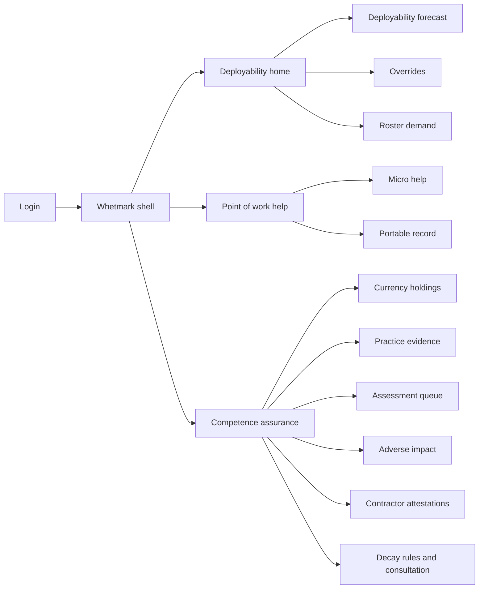
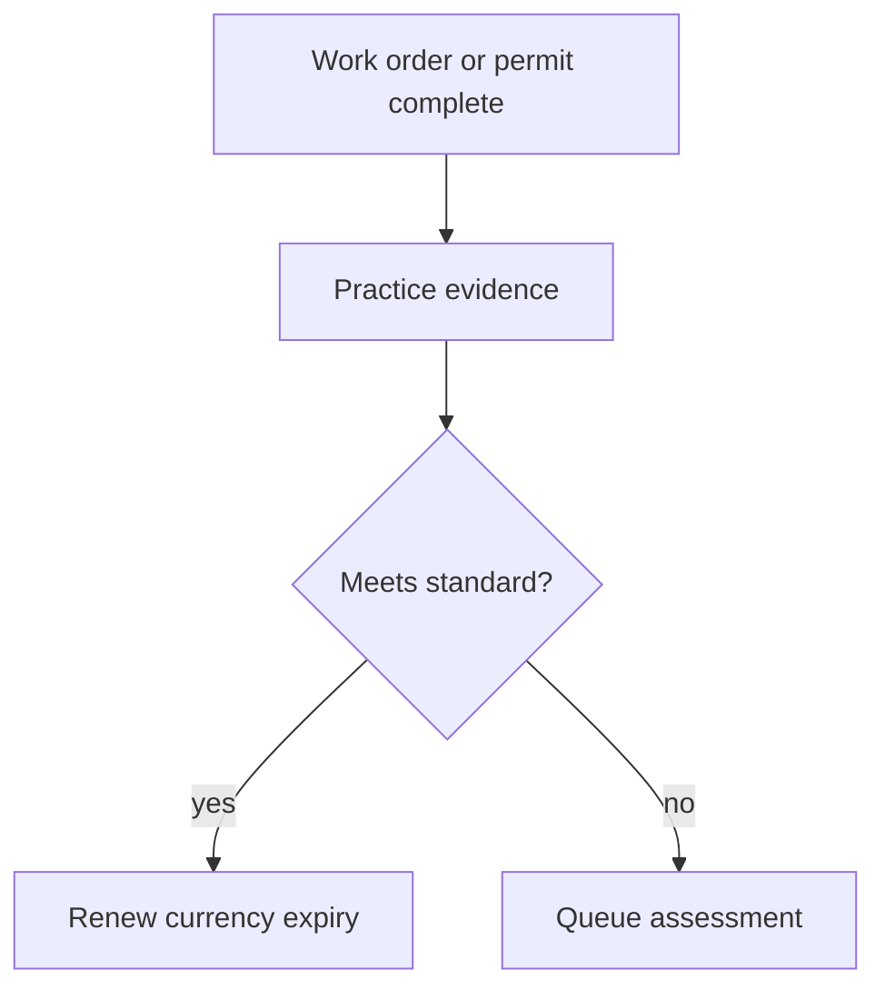
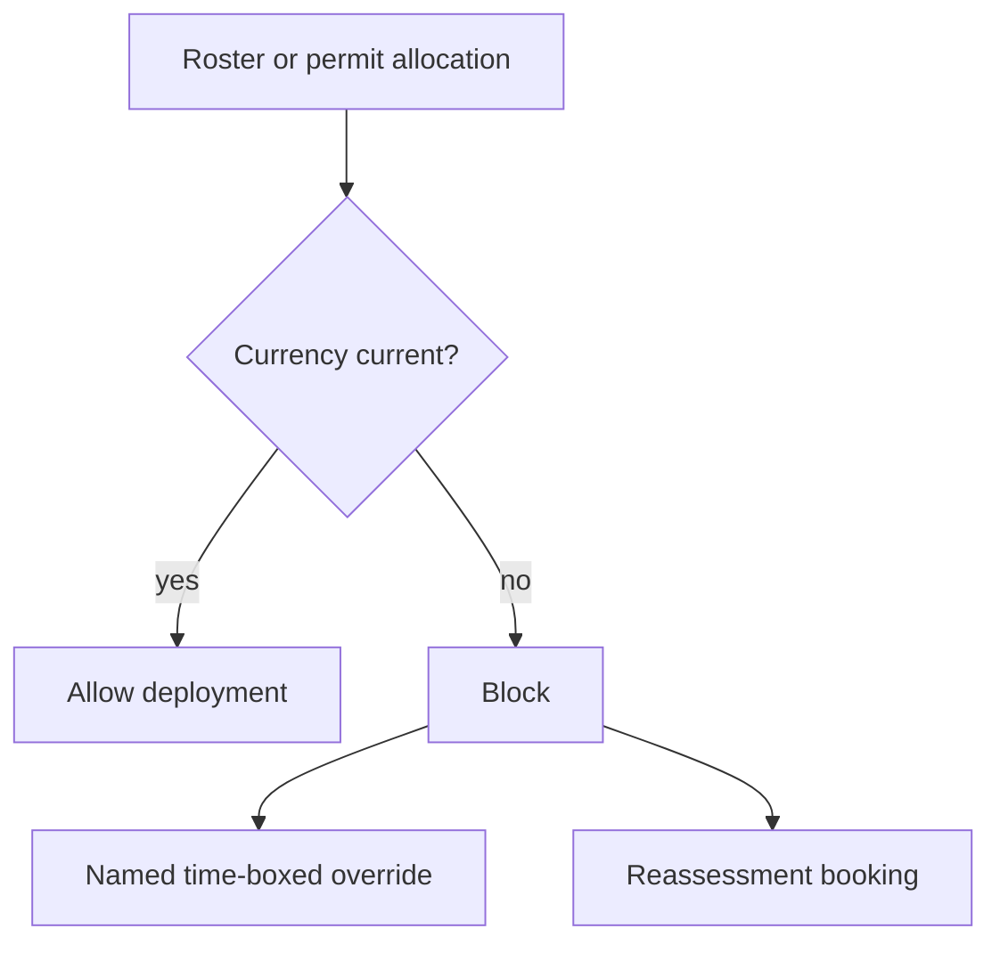

# Whetmark — Web app

**Product:** [PRODUCT.md](./PRODUCT.md)
**Primary surface:** Competence currency console (operations + competence assurance workspace)
**Secondary surfaces:** Field point-of-work micro-help; portable capability record (worker-held export)
**Design thesis:** Whetmark is a whetstone for decaying skills — not an LMS completion wall. The UI metaphor is a currency clock on each capability holding: trained is not deployable; expiry derives from a published decay basis; practice evidence from work orders and permits renews the edge. Visual language is industrial slate and hazard amber on a deep charcoal ground — current holdings feel steel-sharp; lapses and silent overrides feel provisional and loud. The brand wordmark sits as a stamped assay mark on every roster forecast and override so the authorising manager knows whose competence register they are betting a permit on.

## UX research synthesis

### Category peers (best-in-class)

- **SAP SuccessFactors / Cornerstone LMS:** Completion and curricula. Steal: structured learning journeys for new capability; reject completion as proof of currency.
- **ProntoForms / field permit systems / Maximo work management:** Practice evidence from completed work. Steal: work-order and permit feeds as evidence sources; reject covert location tracking as competence proof.
- **Allocate / Quinyx rostering:** Tomorrow’s shift fill. Steal: deployable headcount vs demand as the home question; reject training-hours delivered as the gap metric.
- **Skillsoft Percipio / Degreed (micro-learning):** Point-of-need short help. Steal: two-minute problem help at work; reject forcing macro courses at a substation.

### Patterns to adopt / reject

- **Adopt:** Decay basis + expiry on every holding; practice/assessment evidence standards; deployability forecast in unfilled shifts; time-to-proficiency by entry route; micro vs macro help modes; written lapse reasons + appeal; adverse impact on lapse rates; time-boxed named overrides; contractor verification at boundary; assessor capacity planning; portable records on exit.
- **Reject:** Eternal “trained” badges; spreadsheet matrices as source of truth; silent depot overrides; purple AI skills graphs; completion % as the COO home KPI.

### Trust, density, and workflow constraints from PRODUCT.md

Lapsed capabilities cannot feed roster/permit/allocation (BR-1). Currency needs practice or assessment evidence with published standards (BR-2). Forecast answers “shifts unfilled,” not “hours trained” (BR-3). Lapse decisions need written reasons, named decision-maker, reassessment route (BR-6). Overrides are first-class risk objects (BR-8). Contractors same evidential bar without creating employment-by-conduct (BR-9). Assessor capacity is the binding constraint (BR-11). Consultation before decay-rule changes affecting pay/grade/shifts (BR-12).

## Information architecture

### Nav model

### Roles → default home

| Role | Default home | Why |
|------|--------------|-----|
| Resource scheduler / team leader | Deployability forecast | Shifts fillable tomorrow (BR-3) |
| Field technician | Point-of-work help + my holdings | Micro help + currency clocks (BR-5, BR-1) |
| Competence assessor | Assessment worklist | Clear lapses within service target (BR-11) |
| Competence assurance / safety | Currency + overrides risk | Lawful deployment (BR-1, BR-8) |
| Learning designer | Time-to-proficiency + help modes | Intervention effectiveness (BR-4, BR-5) |
| Contractor manager | Contractor attestations | Boundary verification (BR-9) |

### Cross-links to OpenAPI resources

| Nav area | OpenAPI tags / resources |
|----------|---------------------------|
| Capabilities, decay basis | Capabilities |
| Holdings, suspension, expiring | Currency |
| Practice evidence | Evidence |
| Assessments, bookings, assessor worklist | Assessment |
| Forecast, unlock ranking, roster demand | Deployability |
| Help requests, learning assets, proficiency journeys | Learning |
| Overrides | Overrides |
| Contractor attestations | Contractors |
| Determinations, appeals, adverse impact | Fairness |
| Consultation, evidence packs, portable record | Governance |

## Screen inventory

### Deployability home

- **Purpose:** Answer “how many currently-deployable competent people per capability per location — and which shifts cannot be filled?”
- **Entry:** Ops/scheduler login default.
- **Layout regions:** Brand + depot scope; capability × location deployable counts; unfilled-shift gap; override risk rail; assessor backlog cue.
- **Primary actions:** Open unlock ranking; raise override (gated); request assessment surge.
- **Empty / loading / error:** Empty = register first statutory authorisations; loading = skeleton matrix.
- **BR / story ties:** BR-3.

### Currency holdings (person)

- **Purpose:** Show each capability holding with currency state, expiry, decay basis, and evidence summary.
- **Entry:** Person search; field “my holdings”; roster conflict deep link.
- **Layout regions:** Holding list with clocks; evidence required vs held; lapse determination link; appeal CTA.
- **Primary actions:** Request reassessment; view determination reasons; export portable slice.
- **Empty / loading / error:** Lapsed = cannot assign; reasons required if restricted.
- **BR / story ties:** BR-1, BR-2, BR-6.
- **Mobile notes:** Clocks and reassessment request must work on phone in field.

### Practice evidence inbox

- **Purpose:** Map work orders/permits to evidence standards; renew currency when thresholds met.
- **Entry:** Assurance; holding detail.
- **Layout regions:** Evidence feed; standard definition; accept/reject; shortfall meter.
- **Primary actions:** Accept evidence; flag insufficient; publish standard.
- **Empty / loading / error:** Covert telemetry sources blocked by policy messaging.
- **BR / story ties:** BR-2.

### Assessment queue and bookings

- **Purpose:** Clear lapses via assessment; plan assessor capacity against service target.
- **Entry:** Assessor default; lapse events.
- **Layout regions:** Worklist; booking calendar; capacity vs demand; declination reasons.
- **Primary actions:** Book; complete assessment; decline with reasons.
- **Empty / loading / error:** Backlog past target = coral capacity breach.
- **BR / story ties:** BR-11, BR-6.

### Deployability forecast and unlock ranking

- **Purpose:** Horizon forecast of deployable supply; rank which assessments unlock the most shifts.
- **Entry:** Home; planning.
- **Layout regions:** Date scrubber; capability/location forecast; unlock ranking list.
- **Primary actions:** Prioritise assessor time; export to rostering.
- **Empty / loading / error:** No roster demand feed = prompt integration.
- **BR / story ties:** BR-3, BR-11.

### Point-of-work micro help

- **Purpose:** Two-minute problem help at the moment of work; log micro vs macro resolution mode.
- **Entry:** Field app/PWA; QR on equipment.
- **Layout regions:** Question search; short asset; escalate to macro journey; mode telemetry.
- **Primary actions:** Resolve with micro; start proficiency journey; rate utility.
- **Empty / loading / error:** Offline cache for critical authorisation help.
- **BR / story ties:** BR-5.
- **Mobile notes:** Primary field surface; offline-first for micro assets.

### Time-to-proficiency

- **Purpose:** Measure proficiency by entry route — new hire, move, returner, contractor — not completion %.
- **Entry:** Learning analytics.
- **Layout regions:** Journey funnels by route; median time; intervention compare.
- **Primary actions:** Retire weak interventions; expand what works.
- **Empty / loading / error:** Completion-only data = incomplete state.
- **BR / story ties:** BR-4.

### Overrides register

- **Purpose:** Time-boxed, named, compensated deployment overrides — never silent.
- **Entry:** Roster block; safety risk rail.
- **Layout regions:** Active overrides; authorising manager; compensating controls; expiry; standing risk exposure.
- **Primary actions:** Authorise; close; escalate overdue.
- **Empty / loading / error:** Empty = healthy; silent workaround attempt logged as integrity incident.
- **BR / story ties:** BR-8.

### Contractor attestations

- **Purpose:** Verify contractor capability at boundary against issuing body; avoid employment-by-conduct UI patterns.
- **Entry:** Contractor manager.
- **Layout regions:** Attestation pack; verification status; capability holdings mirrored; no task-direction chrome.
- **Primary actions:** Verify; reject; set expiry.
- **Empty / loading / error:** PDF self-cert without verification = not deployable.
- **BR / story ties:** BR-9.

### Lapse determination and appeal

- **Purpose:** Written restriction reasons, named decision-maker, reassessment/appeal within published period.
- **Entry:** Holding suspension; worker notification.
- **Layout regions:** Evidence relied on; decision-maker; appeal form; clock.
- **Primary actions:** Appeal; book reassessment; withdraw restriction on success.
- **Empty / loading / error:** Missing decision-maker = block suspension.
- **BR / story ties:** BR-6.

### Adverse impact review

- **Purpose:** Test lapse and assessment outcomes vs protected characteristics, working pattern, leave history.
- **Entry:** Fairness annual cycle; executive.
- **Layout regions:** Disparity tables; remediation path; executive sign-off.
- **Primary actions:** Run review; attach remediation; report.
- **Empty / loading / error:** Overdue annual review = coral compliance banner.
- **BR / story ties:** BR-7.

### Decay rules and consultation

- **Purpose:** Version decay bases and deployment rules; attach consultation record before pay/grade/shift effects.
- **Entry:** Governance.
- **Layout regions:** Decay basis editor; history; consultation attachment; effective dating.
- **Primary actions:** Propose change; attach consultation; publish.
- **Empty / loading / error:** Change without consultation = block publish.
- **BR / story ties:** BR-12, BR-1.

### Portable capability record

- **Purpose:** Worker-held verifiable record on exit/transfer without assessor free-text exposure.
- **Entry:** Worker profile; HR exit.
- **Layout regions:** Verifiable holdings; cryptographic/attest seal; redacted observations.
- **Primary actions:** Generate; download; verify externally.
- **Empty / loading / error:** No current holdings = empty portable with explanation.
- **BR / story ties:** BR-10.

## Key flows

1. **Practice renews currency** — work evidence arrives → meets published standard → holding expiry extends; failure: insufficient evidence → assessment path (BR-2).

2. **Roster blocked by lapse** — allocation checks holding → lapsed → block → override or reassessment (BR-1, BR-8).

3. **Assessor clears backlog by unlock value** — forecast gaps → unlock ranking → book assessments → restore deployability (BR-3, BR-11).

4. **Fair lapse** — determination with reasons → appeal window → adverse impact monitoring (BR-6, BR-7).

5. **Contractor boundary verify** — attestation → issuing-body verification → deployable holding without tasking UI (BR-9).

## Design system

### Tokens (CSS variables)

- `--color-ink: #E6E2DA`
- `--color-ground: #12140F`
- `--color-panel: #1A1E16`
- `--color-rule: #3A4030`
- `--color-steel: #8A9A7A` — current / deployable
- `--color-amber: #E0A020` — expiring / override active
- `--color-hazard: #D94F3D` — lapsed / roster block
- `--color-assay: #C4B896` — Whetmark brand stamp
- `--font-display: "Barlow Condensed", sans-serif` — industrial display for clocks and forecasts
- `--font-body: "IBM Plex Sans", sans-serif`
- `--font-mono: "IBM Plex Mono", monospace` — authorisation codes, permit ids
- `--space-1`…`--space-8`: 4px scale
- `--radius-sm: 2px`; `--radius-md: 6px`
- `--motion-tick: 200ms linear` — currency clock tick near expiry
- `--motion-block: 160ms ease-in` — roster block interrupt
- `--motion-renew: 220ms ease-out` — evidence renew flash
- Atmosphere: subtle brushed-metal grain; cool industrial vignette; no stock classroom photography.

### Typography & brand

- Condensed display for deployable counts and clocks; mono for authorisation and permit codes.
- Assay stamp on forecast, override, and portable record.
- Login: brand hero; headline (“Trained is not deployable”); one CTA.

### Do / don’t

- **Do:** Show expiry everywhere holdings matter; block lapsed from roster; name overrides; plan assessors; micro-help offline; portable records on exit.
- **Don’t:** Eternal completion badges; silent overrides; purple skills AI; completion % as home; card grids of vanity learning hours.

### Accessibility & domain trust cues

- AA+; hazard states also via icon + text.
- Live regions for lapse, override expiry, assessor SLA breach.
- Focus: holding → evidence → assessment → deployability.
- Field UI large tap targets with gloves in mind.

## Component patterns

- **CurrencyClock** — state + expiry from decay basis.
- **DeployabilityMatrix** — capability × location × unfilled shifts.
- **UnlockRankingList** — assessments ordered by shifts restored.
- **PracticeEvidenceCard** — standard vs held evidence.
- **OverrideRiskBanner** — time-box, authoriser, compensating controls.
- **MicroHelpSheet** — two-minute point-of-work help.
- **LapseDeterminationNotice** — reasons + decision-maker + appeal.
- **ContractorBoundaryAttestation** — verify without directing work.
- **AssessorCapacityMeter** — lapse-to-reassessment SLA.
- **PortableCapabilitySeal** — worker-held verifiable export.

## Out of scope for v1 web

- Full LMS authoring suite; ERP/Maximo replacement; biometric site access; consumer career social network; multi-employer skills passport federation beyond portable export; native apps beyond PWA field help.
